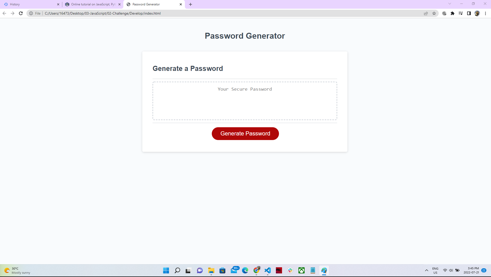
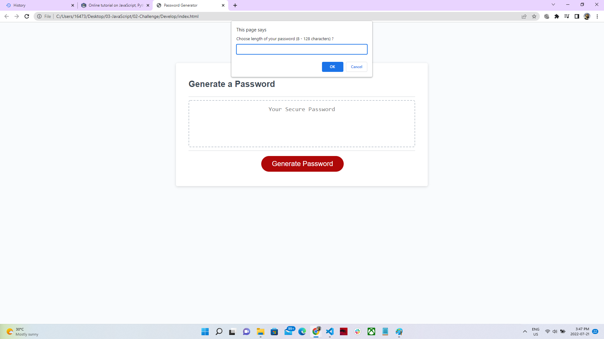
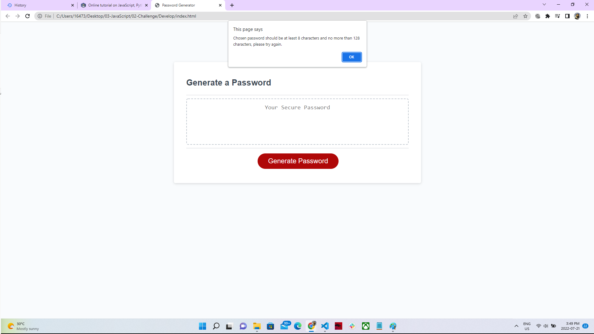
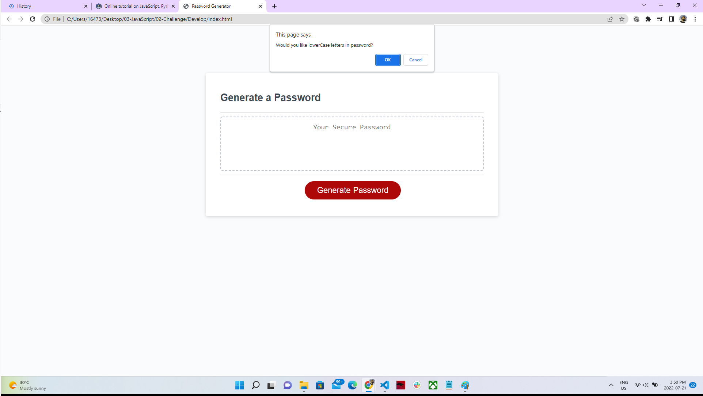
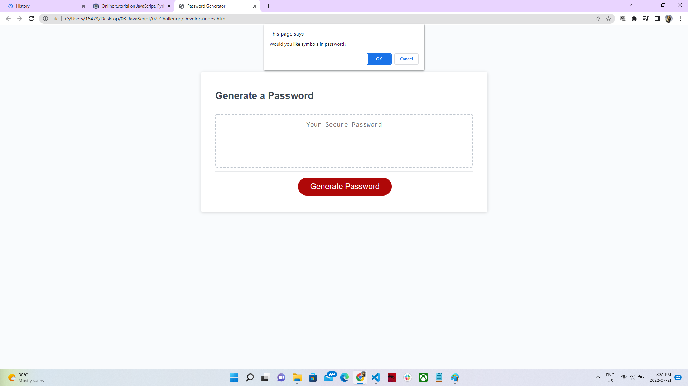
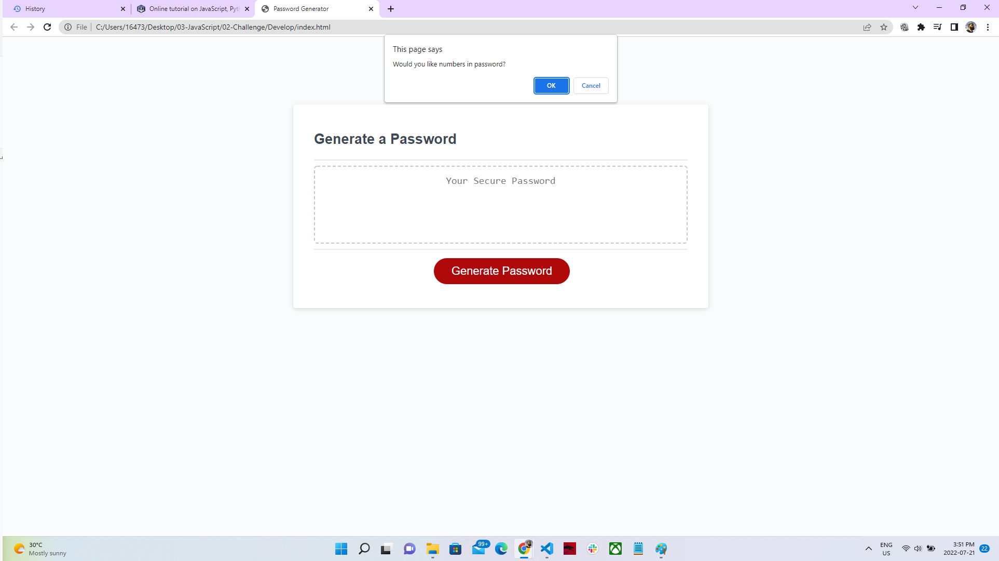
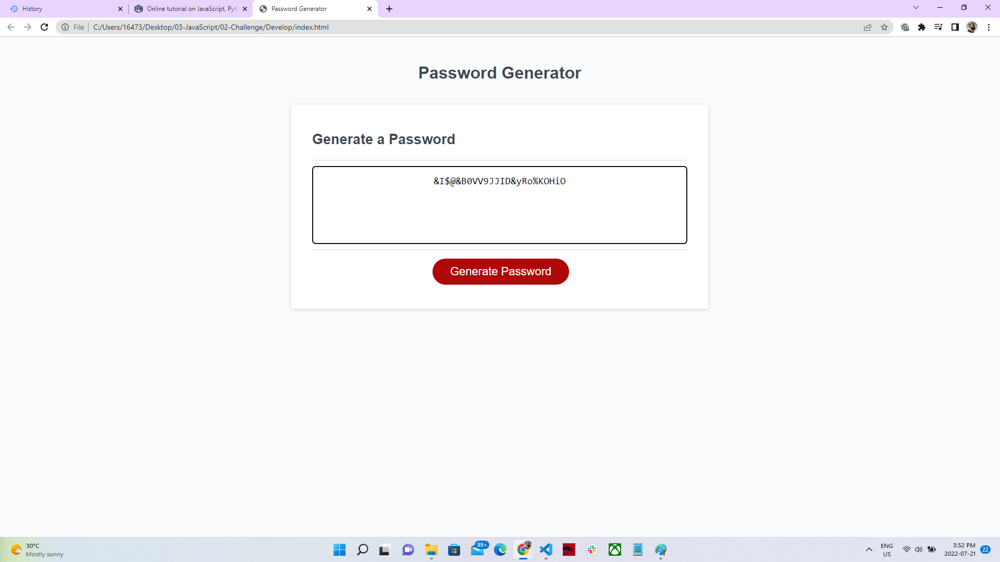

# 03 JavaScript: Password Generator

## About Project

Generate Random Password is a web base application that generate dynamically customize secure passwords according to user selected criteria. 

The app runs in the browser and features updated HTML and CSS powered by JavaScript code and it adapts to multiple screen sizes.

When we click on the button "Generate Password", A series of prompts appears which are asking certain criteria:
Define lenght of password (that should be 8 - 128 characters long)
Set the parameters (Uppercase letters,Lowercase letters, Numbers and Special characters)
All the parameters approch correct
random password generates. 

## Tech

HTML 
CSS 
JAVA SCRIPT

## Screenshots

## Links

* The URL of the deployed application.

https://asrabilal.github.io/JSPasswordGenerator/

* The URL of the GitHub repository that contains your code. Give the repository a unique name and include a README file that describes the project.

https://github.com/asrabilal/JSPasswordGenerator.git

© 2022 Asra Solution Sevices, Inc.
